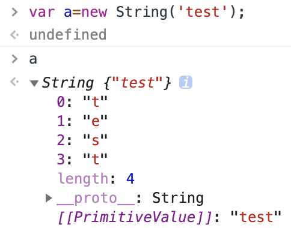

# 原始型別與物件型別
## 1.原始型別(Primitive Data Type)
1. Boolean
2. Null
   1. typeof null會回傳Object,這是js的歷史錯誤
3. Undefined
4. Number
5. String
6. BigInt
7. Symbol
### 包裹物件
1. 上述型別除Null與Undefined外皆有`包裹物件`,提供各自的許多方法,如String的.toLowerCase()
2. 透過`new 型別()`來建立,如下
3. `__proto__`內即為該物件可調用的方法/屬性
4. 操作原始型別時會自動透過包裹物件建立
5. 盡量避免透過包裹物件建立原始型別變數,因為建立的會是**物件**而非**原始型別**

## 2.物件型別(Object Data Type)