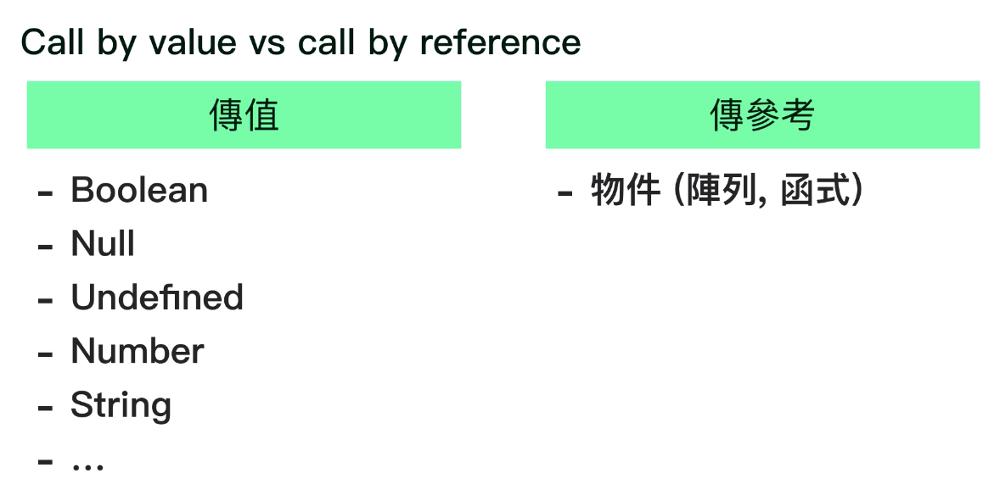

# 傳值(Call by value)與傳參考(Call by reference)
1. 傳值:變數記憶體空間直接儲存值
2. 傳參考:變數記憶體空間儲存值所在的位置

```js
var person1='Zhuang';
var person2=person1;
person2='Xiang';
//person1之質仍為Zhuang
//因為var person2=person1時是複製一份值而非值的位置

var person1={
    name:'Zhuang'
};
var person2=person1;
person2.name='Xiang';
//person1.name會變為Xiang
//因為var person2=person1時是將值的位置賦予person2
//故透過person2修改值,person1取得的便是修改後的值
```
3. 改變指向位置,不改變原指向參考位置內容
```js
var family={
    father:'Father',
    mom:'Mother',
    assets:{
        currency:1000
    }
};
var someThing=family.assets;
var someThing={a:'a'};
//由於someThing指向的記憶體位置改變
//故family的assets並未改變
```
4. 循環參考
```js
var a={x:1};
a.y=a;
//a新增屬性指向自己的記憶體位置,會產生y無限循環參考a的記憶體位置
```
5. `=`指派順序為**同時**執行,左側被指派變數指向位置不改變
```js
//設{x:1}記憶體位置0x01
//a指向0x01
var a={x:1};
//b指向0x01
var b=a;
//設{x:2}記憶體位置0x02
//a指向0x02同時a(指向0x01).y指向a={x:2}的結果(0x02)
a.y=a={x:2};
//a=>{x:2}(0x02)
//b=>{x:1,y:{x:2}
```
```js
var a={x:1};
//a={x:1}
var b=a;
//b={x:1}
a.x={x:2};
//a={x:{x:2}}
//b={x:{x:2}}
a.y=a={y:1};
//a={y:1};
//b={x:{x:2},y:{y:1}}
```