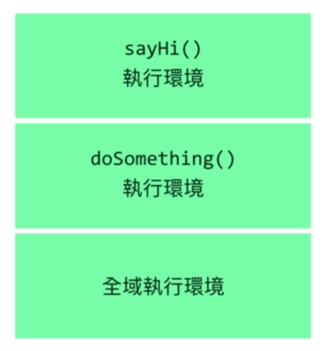

# 執行環境(Execution context)
1. 函式執行時會產生`執行環境`,執行n次,產生n個,不執行為**0**個
2. 執行環境有`限制作用域`的功能
3. 擁有自己的`this`
4. 全域(Global)也擁有自己的`全域執行環境`
   1. 網頁/Node.js一啟動便建立
   2. 產生`window`(browser)或`global`(Node.js)變數
   3. 產生`this`等於window/global

# 執行堆疊(Execution stack)
1. 執行環境由呼叫順序**由下往上**堆疊,稱為`執行堆疊`,如下程式碼與其堆疊
2. 與編寫順序無關,而與呼叫順序有關
3. 離開時順序相反,**由上往下**消滅
```js
var sayHi=(name)=>{
    var greeting=`hi ${name}`;
    return greeting;
}

var doSomething=()=>{
    var mom='mother';
    console.log(1,sayHi(mom))
}

doSomething();
```


