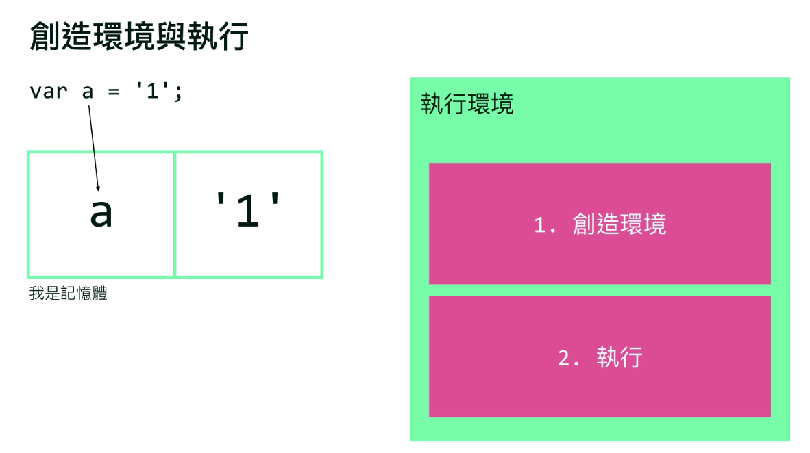

# 提升(Hoisting)
1. 提升並非專有名詞,而是釐清JavaScript在執行階段內文如何運作的思路(尤其是在創造環境和執行)
2. 完整的執行環境包含**創造環境**與**執行**,**宣告變數**與**函式宣告**二者會於執行環境優先配置於記憶體中,即**創造環境**
3. 執行才會進行**賦值**與**執行函式**
4. 注意,並不意味著**宣告變數**與**函式宣告**提升到程式碼上方,而是這二者在編譯階段便被放置入記憶體

5. 範例程式碼
```js
var ming='Ming'
console.log(ming)
//拆解後
//創造環境
var ming
//執行
ming='Ming'
console.log(ming)
//得Ming
//-----------------------------
console.log(ming2)
var ming2='Ming2'
//拆解後
//創造環境
var ming2
//執行
console.log(ming2)
ming2='Ming2'
//得undefined
//-----------------------------
callName()
//韓式陳述式
function callName(){
    console.log('This is Ming')
}
//拆解後
//創造環境
function callName(){
    console.log('This is Ming')
}
//執行
callName()
//得This is Ming
//-----------------------------
//函式表達式
var callName=function(){
    console.log('This is Ming2')
}
callName()
//拆解後
//創造環境
var callName
//執行
callName=function(){
    console.log('This is Ming2')
}
callName()
//得This is Ming2
//-----------------------------
callName()
var callName=function(){
    console.log('This is Ming2')
}
//拆解後
//創造環境
var callName
//執行
callName()
callName=function(){
    console.log('This is Ming2')
}
//得Exception callName is not a function
//-----------------------------
function callName(){
    console.log('This is Ming3')
}
var callName=function(){
    console.log('This is Ming4')
}
callName()
//拆解後
//創造環境
var callName
//執行
function callName(){
    console.log('This is Ming3')
}
callName=function(){
    console.log('This is Ming4')
}
callName()
//得This is Ming4
//-----------------------------
function callName(){
    console.log('This is Zhuang')
}
callName()
function callName(){
    console.log('This is Xiang')
}
callName()
//拆解後
//創造環境
function callName(){
    console.log('This is Zhuang')
}
function callName(){
    console.log('This is Xiang')
}
//執行
callName()
callName()
//得
//This is Xiang
//This is Xiang
//-----------------------------
whosName()
function whosName(){
    if(name){
        name='Xiang'
    }
}
var name='Zhuang'
console.log(name)
//拆解後
//創造環境
function whosName(){
    if(name){
        name='Xiang'
    }
}
var name
//執行
whosName()
name='Zhuang'
console.log(name)
//得Zhuang
//-----------------------------
```
***
## 補充undefined vs not defined
1. undefined:已配置記憶體,未賦值
2. not defined:未配置記憶體
3. 避免將undefined賦予變數,應使用null